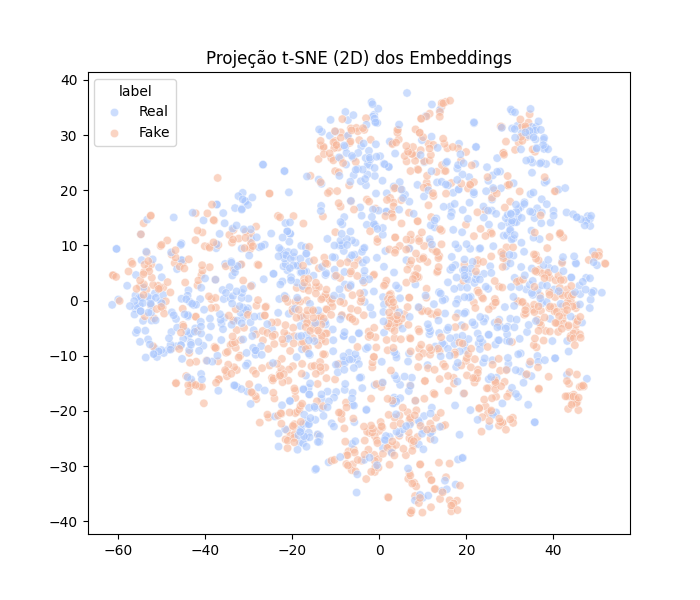
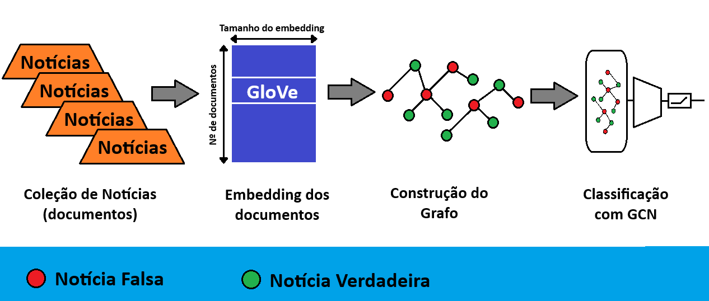
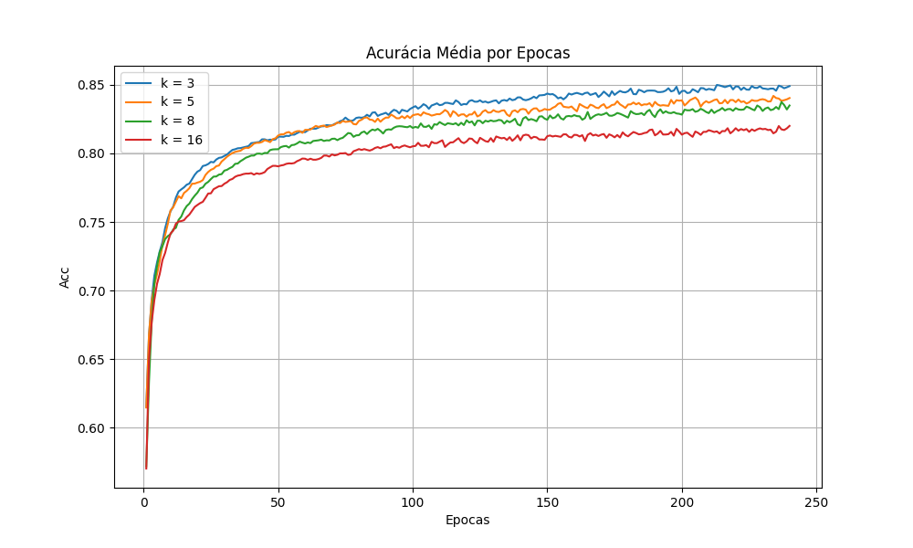
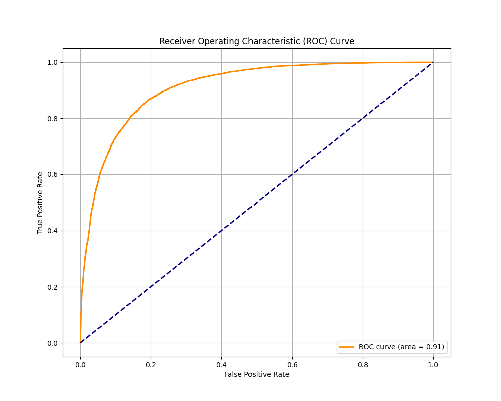
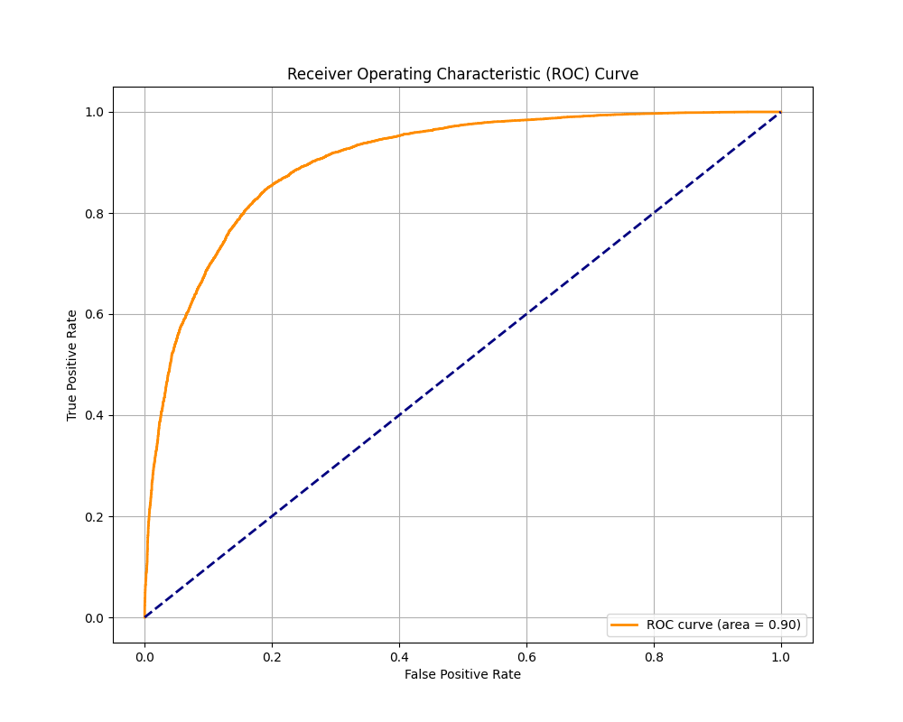
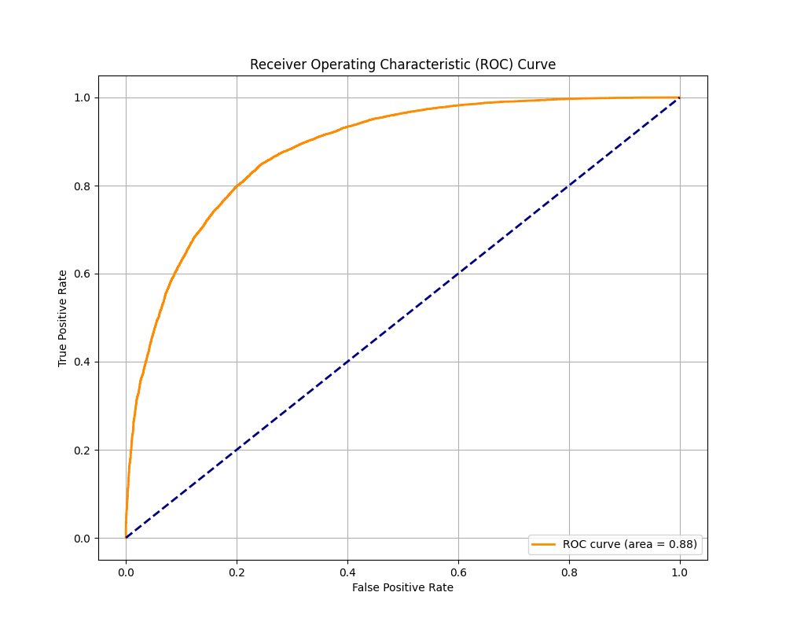

# 📰 Detecção de Fake News com Redes Neurais de Grafos (GNNs)

Este projeto implementa um modelo de **Graph Convolutional Network (GCN)** com **Batch Normalization (GCN_BN)** para a tarefa de **detecção de fake news**.  
O trabalho foi desenvolvido como parte de um projeto acadêmico e tem como objetivo avaliar a eficácia das **redes neurais de grafos** aplicadas ao **processamento de linguagem natural (PLN)**.

---

## 🎯 Motivação
A propagação de **fake news** tem impacto crescente em áreas sociais, políticas e econômicas. Modelos tradicionais de classificação de texto (baseados apenas em embeddings e redes densas) nem sempre capturam as **relações estruturais entre documentos**.  
Neste projeto, exploramos o uso de **grafos de similaridade** construídos a partir de embeddings GloVe e conectados via **K-Nearest Neighbors (KNN)**, treinando um modelo GCN para classificar notícias como verdadeiras ou falsas.

---

## 📊 Dataset
- Fonte: [Mendeley Fake News Dataset](https://data.mendeley.com/datasets/945z9xkc8d/1)  
- Pré-processado e dividido em:
  - **80% treino**, **10% validação**, **10% teste**
- Estrutura:
```csv
  text,label
  "Trump promises new deal for black America...",0
  "Foundation ties bedevil Hillary Clinton...",1
  ...
```

* **Label**:

  * `0` → Notícia verdadeira
  * `1` → Fake News

---

* **Balanceamento das classes**:


* **t-SNE**:

O t-SNE (\textit{t-distributed stochastic neighbor embedding}) verificar se os dados são  separáveis de maneira não linear.


## 🧩 Metodologia



1. **Pré-processamento**: tokenização, remoção de stopwords e padronização.
2. **Embeddings**: GloVe (100d), cada documento representado pela média dos vetores de suas palavras.
3. **Construção do grafo**:

   * Similaridade de cosseno entre embeddings de documentos.
   * Conexão via **KNN** com valores de `k = 3, 5, 8, 16`.
4. **Modelo**:

   * Arquitetura **GCN\_BN**:

     * Camada GCN → BatchNorm → ReLU → Dropout
     * Camada GCN → Softmax (classificação)
   * Treinado por até 240 épocas com `lr=0.005` e `dropout=0.5`.
5. **Avaliação**:

   * Validação cruzada (5-fold).
   * Métricas: **Acurácia, F1-score, Precisão, Recall, AUC**.

---

## 📈 Resultados

* Melhor configuração: **k=3**
* Acurácia média ≈ **84%**
* F1-score ≈ **84%**
* Resultados consistentes e comparáveis aos benchmarks da literatura.

**Acurácia**:


**Curva ROC**:








---

## 📂 Estrutura do Repositório

```
├── data/
│   ├── raw/           # Dataset original
│   ├── processed/     # Embeddings e grafos salvos
│   └── outputs/       # Resultados, gráficos e métricas
├── notebooks/         # Notebooks de experimentação
│   ├── img/
├── requirements.txt   # Dependências do projeto
└── README.md          # Este arquivo
```

---

## ⚙️ Como Executar

1. Clone o repositório:

   ```bash
   git clone https://github.com/BrunodaSilvaMachado/fake_news_detection.git
   cd fake_news_detection
   ```
2. Crie o ambiente e instale dependências:

   ```bash
   pip install -r requirements.txt
   ```
3. Baixe os embeddings do [GloVe 100d](https://nlp.stanford.edu/projects/glove/):

   ```bash
   glove.6B.100d.txt
   ```
4. Rode o treino:

   ```bash
   python src/train.py
   ```

---

## 👨‍💻 Contribuições

* Implementação: construção de grafos de similaridade e treinamento de GCN.
* Experimentos: análise com diferentes valores de k.
* Avaliação: validação cruzada e comparação com benchmarks da literatura.

---

## 📚 Referências

* Kipf, T., & Welling, M. (2017). Semi-Supervised Classification with Graph Convolutional Networks.
* Zhang et al. (2023). Text Classification Based on the Heterogeneous Graph Considering the Relationships between Documents.
* Meel, P., & Vishwakarma, D. (2021). Fake News Detection using Graph Neural Networks.
* Priyanga et al. (2021). Exploring fake news identification using word and sentence embeddings.

